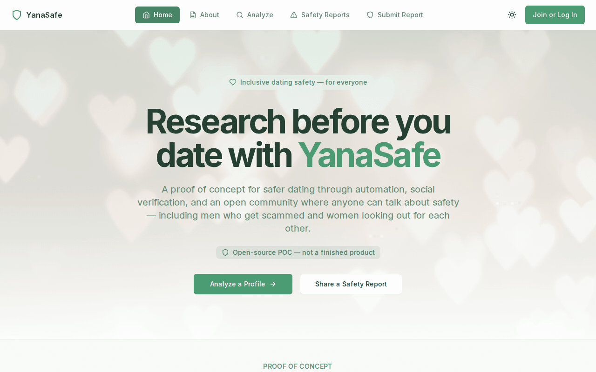
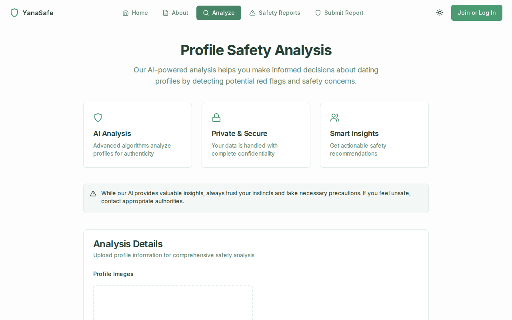
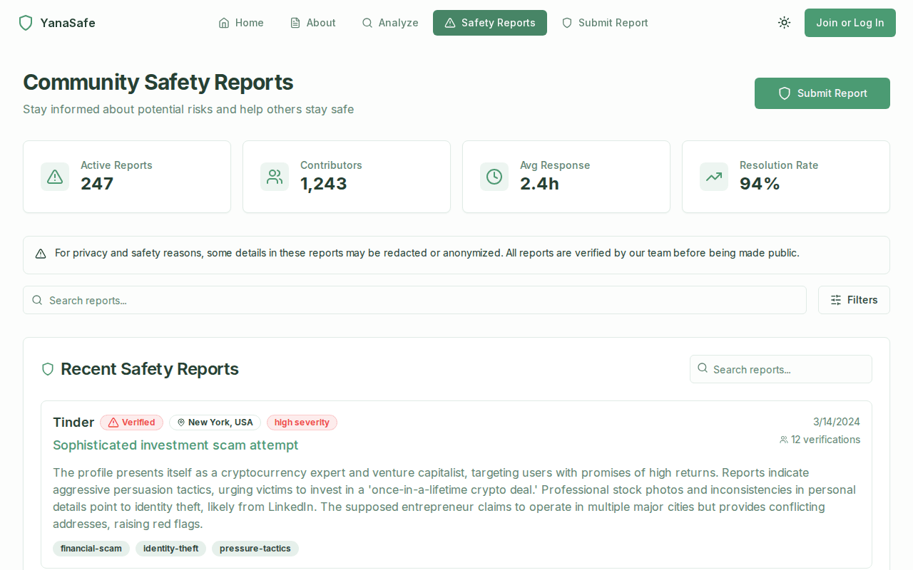
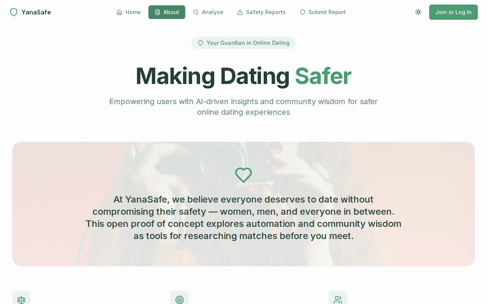
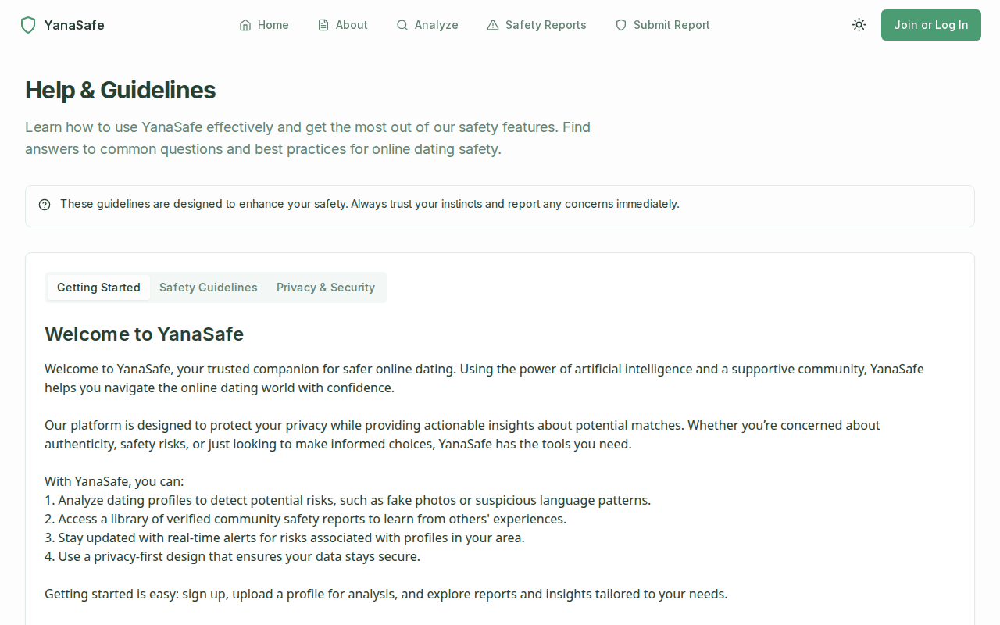
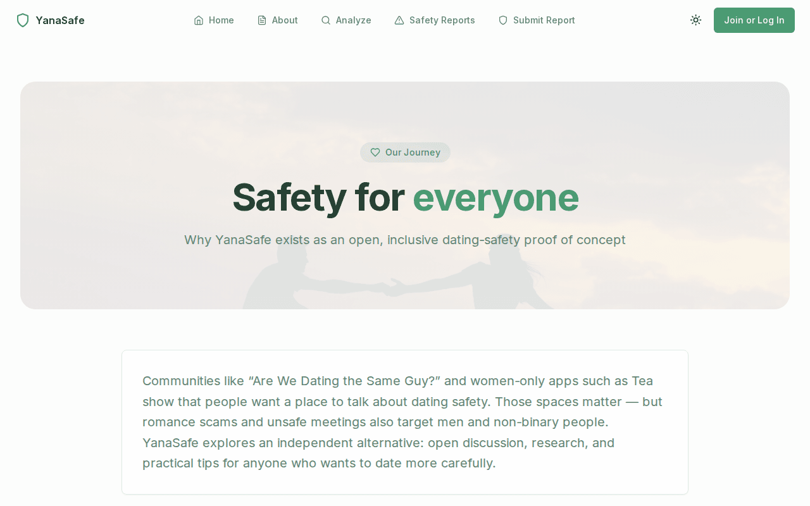

# YanaSafe

**Inclusive dating safety — an open proof of concept.**

YanaSafe explores how automation, social/profile signals, and community reports can help people research a match before they meet. It is independent, open-source, and built for **everyone** — not a women-only space.

Romance scams and unsafe dates affect people of every gender. Women-only apps such as Tea meet a real need, but men and others get scammed too. YanaSafe is a place to talk about safety, share assessments, and surface practical tips together.

> This is a **proof of concept**, not a production-ready product. Analysis defaults to mock data. Treat community content as unverified opinions, never as legal advice or a substitute for your judgment or emergency services.

**Public repository:** https://github.com/ahmadpoorgholam/yanasafe

## Screenshot catalog

Captured from a local headless Chromium run of the POC UI.

| Screen | Preview |
|--------|---------|
| Home |  |
| Profile analysis |  |
| Community safety reports |  |
| About |  |
| Help & guidelines |  |
| Our story |  |

## Why this exists

- **Automation** — profile image + context analysis that returns a safety score, flags, and suggestions
- **Community verification** — submit and browse safety reports about people and patterns
- **Practical tips** — meet in public places, avoid rushing to private hotels, do not hand over room keys or account access, go slow on fancy isolated restaurants when you are unsure
- **Inclusive by design** — anyone can research and discuss; safety talk should not be one-sided

## What works today vs roadmap

| Area | Today (POC) | Roadmap |
|------|-------------|---------|
| Profile analysis UI | Working | Richer signals / social verification |
| AI backend | **Mock by default** (`USE_MOCK_DATA`); optional Perplexity path | Hardened live models |
| Community reports | Submit to Firestore; browse uses demo/mock lists | Live moderated feeds |
| Auth | Google / Gmail via Firebase | Broader providers, stronger account safety |
| i18n / dashboard | English only; no dashboard | Locales + personal safety hub |
| PWA / icons | Manifest stub | Real installable assets |

## Quick start

**Requirements:** Node.js 18+, a Firebase project (Auth, Firestore, Storage).

```bash
git clone https://github.com/ahmadpoorgholam/yanasafe.git
cd yanasafe
npm install
cp .env.example .env.local
```

Fill Firebase keys in `.env.local`. Keep `USE_MOCK_DATA=true` for local demos. To try live AI analysis:

```env
USE_MOCK_DATA=false
PERPLEXITY_API_KEY=your_key
```

```bash
npm run dev
```

Open [http://localhost:3000](http://localhost:3000).

## Tech stack

- **Next.js 14** (App Router) · **React 18** · **TypeScript** · **Tailwind** · **shadcn/ui**
- **Firebase** Auth, Firestore, Storage
- Optional **Perplexity** API for live profile analysis

## Project map

```
app/                 # Routes (home, analyze, report(s), help, about, legal)
app/api/             # /api/analyze-profile
components/          # UI, auth, home, reports
lib/                 # Firebase, services, types, static help content
docs/                # Architecture, API, security (honest POC notes)
```

## Safety disclaimer

YanaSafe does not verify every report, does not replace police or emergency services, and must not be used for harassment, doxxing, or illegal activity. Always verify independently. If you are in immediate danger, contact local emergency services.

## Contributing

Issues and pull requests are welcome. Keep changes focused; prefer honesty over marketing claims in docs and UI.

## License

MIT © [ahmadpoorgholam](https://github.com/ahmadpoorgholam) — see [LICENSE](LICENSE).

## Docs

- [Architecture](docs/ARCHITECTURE.md)
- [API](docs/API.md)
- [Security](docs/SECURITY.md)
- [Onboarding](ONBOARDING.md)
